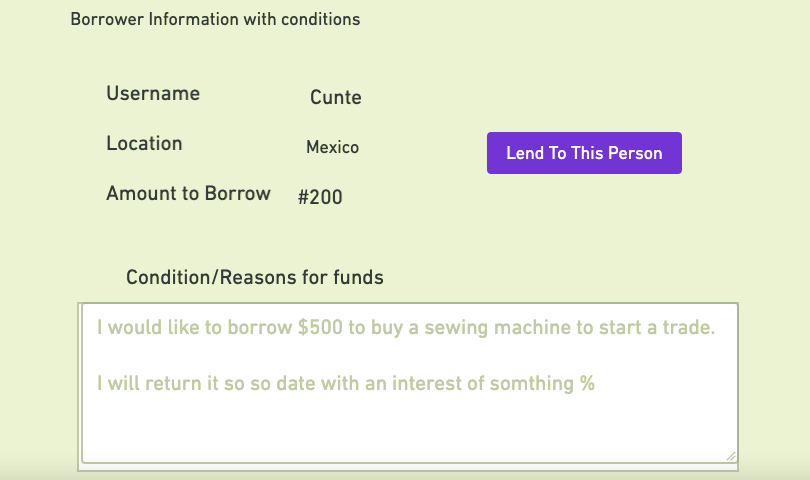

# Project Overview

This project is React implementation of ecommerce site using https://airtable.com/api

## Project Name
Micro-lending React App

## Project Description

In this project,a fully functional peer to peer micro-lending app will be built using React JS. Often times people go to Payday to borrower money at usury interest rates. With this app people can have access to funds at reasonable interest rates. Individual lenders can only earn interest more than what banks and other finacial institions are offering their customers
In the backend, the E-commerce administrator will be able to do the following:
- Able to add borrower
- View list of product in the store
- Add product to the shopping cart


## Wireframes


<table align="center">
  <tr>
    <td align="center">Home Page</td>
    </tr>
  <tr>
    <td></td>
     </tr>
 </table>
 
 <table align="center">
  <tr>
    <td align="center">Borrower Information</td>
    </tr>
  <tr>
    <td></td>
     </tr>
 </table>
 
<table align="center">
  <tr>
    <td align="center">Create Borrower</td>
    </tr>
  <tr>
    <td></td>
     </tr>
 </table>
 


Upload images of your wireframes to an image hosting site or add them to an assets folder in your repo and link them here with a description of each specific wireframe.


<table align="center">
  <tr>
    <td align="center"> Component Hierarchy</td>
    </tr>
  <tr>
    <td></td>
     </tr>
 </table>

## API and Data Sample

Show us a snippet of JSON returned by your Airtable (you can find it under the API documentation) so we know you can access it and get the info you need. This **must** be properly formatted. An example is below:

```json
{
    "records": [
        {
            "id": "recUWgp8y9KdGjiaI",
            "fields": {
                "name": "Gold Watch",
                "category": "Accessory",
                "description": "Danish design by Jakob Wagner for a timeless look Interchangeable straps for versatility Ethical packaging for a more sustainable tomorrow Dial Colour...",
                "price": "30",
                "qauntity": "10"
            },
            "createdTime": "2021-03-26T13:10:03.000Z"
        },
        {
            "id": "recNIie1gm7CsH70H",
            "fields": {
                "name": "Philosopher - BUNDLE White",
                "category": "Accessory",
                "description": "Ethical packaging for a more sustainable tomorrow",
                "price": "40",
                "qauntity": "20"
            },
            "createdTime": "2021-03-26T13:10:03.000Z"
        },
        {
            "id": "recL5Lclb4v9qWsvs",
            "fields": {
                "name": "Womens Gold Rolex Watch 16233",
                "category": "Accessory",
                "description": "Rolex Datejust 36MM with a Jubilee Band. You can customize the bezel type between Gold Fluted Bezel or Diamond Bezel",
                "price": "50",
                "qauntity": "52"
            },
            "createdTime": "2021-03-26T13:10:03.000Z"
        }
    ],
    "offset": "recL5Lclb4v9qWsvs"
}

```

### MVP/PostMVP

#### MVP
-Able to add new borrowers
- View new borrowers
## Project Schedule

This schedule will be used to keep track of your progress throughout the week and align with our expectations. Here's an example.

| Day        | Deliverable                                        | Status     |
| ---------- | -------------------------------------------------- | ---------- |
| July 10-12 | Prompt / Wireframes / Priority Matrix / Timeframes | Incomplete |
| July 13    | Project Approval                                   | Incomplete |
| July 13    | Core Application Structure (HTML, CSS, etc.)       | Incomplete |
| July 14    | Pseudocode / actual code                           | Incomplete |
| July 15    | Initial Clickable Model                            | Incomplete |
| July 16    | MVP                                                | Incomplete |
| July 17    | Presentations                                      | Incomplete |

## Timeframes

Tell us how long you anticipate spending on each area of development. Be sure to consider how many hours a day you plan to be coding and how many days you have available until presentation day.

Time frames are also key in the development cycle. You have limited time to code all parts of your app. Your estimates can then be used to evalute possibilities based on time needed and the actual time you have before the app must be submitted. It's always best to pad the time by a few hours so that you account for the unknown so add an additional hour or two to each component to play it safe. Throughout your project, keep track of your Time Invested and Actual Time and update your README regularly.

| Component        | Priority | Estimated Time | Time Invested | Actual Time |
| ---------------- | :------: | :------------: | :-----------: | :---------: |
| Adding prduct Form      |    H     |      3hrs      |        |       |
| Working with API |    H     |      3hrs      |        |       |
| Total            |    H     |      6hrs      |          |        |

## SWOT Analysis

### Strengths:
 I can put this together in using react using examples of what we have been doing in the class
### Weaknesses:
 UI/styling and positioning of it tags is still a challenge for me
### Opportunities:
A chance for me to play with uploading images

### Threats:
I don't see any threats here now
